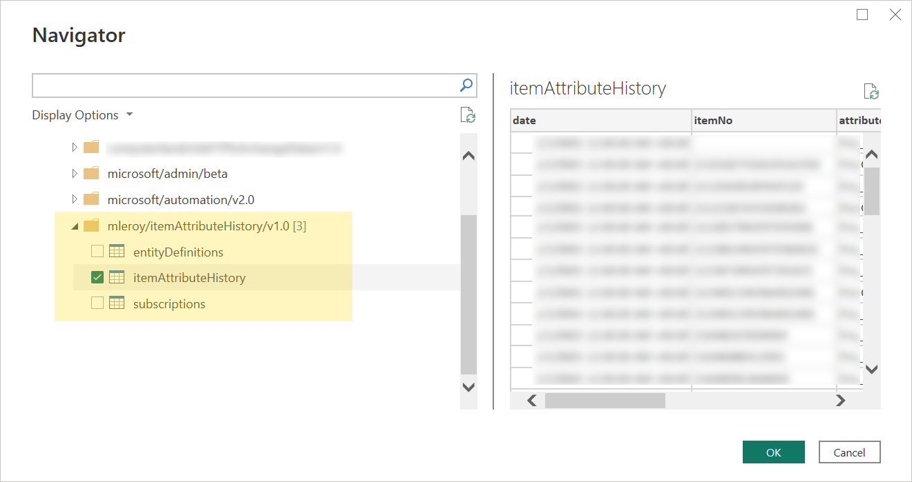

# Item Attribute History
_A Microsoft Dynamics 365 Business Central extension_

Items in Business Central can be assigned attribute values, such as `"Color": "Red"`. The base application keeps track of item attribute mappings in a table aptly named _Item Attribute Value Mapping_, but only their latest value.

If keeping a historical record of attribute values is important to your business operations or to your reporting, keep reading.

*Item Attribute History* is an extension for Business Central that maintains a history of attribute values as they are added / modified / deleted from items. With it, you are able to look back in time and see what attribute value was set on an item at any given time (... from the point you install this extension!).

Additional context available on this post: [Announcing Business Central Item Attribute History](https://marvyn.io/tech/business-central-item-attribute-history-1.0/).

### What's included

##### History Table

[ItemAttributeHistory](table/ItemAttributeHistory.Table.al) is a new table that will be created in your existing Business Central database. Fields it keeps track of:

| Field | Details |
| ----- | ------- |
| Date  | (a DateTime) when the insertion / modification / deletion event occurred
| Item No | - |
| Attribute Name |- | 
| Attribute Value | -|
| Event Type | One of `Insert` / `Modify` / `Delete` / `Initial setup` |
| Event By | `User name` behind the change. Unavailable for 'Delete' events. |

Note that it stores literal attribute name and values and not their ID. This is a feature of the history table in that renaming a field should not modify the history.

##### History Page

The extension automatically makes a page available to consult the history table. Access it by searching for _Item Attribute History_.

##### History Query

A query is created as well for your reporting needs. There is no need to manually create a web service to expose the page or the query itself.

Example from Power BI:

##### Logic

Implementation relies on the built-in event bus, or what are called [Table Triggers](https://learn.microsoft.com/en-us/dynamics365/business-central/dev-itpro/developer/triggers-auto/devenv-triggers), to detect changes to the _Item Attribute Value Mapping_ table. 

This technique allows detection of changes no matter whether they originate from the Web Client, another extension, or a programmatic update.

### Installation
You will need to clone the repository and build from source first.

(sorry, I haven't figured out how to setup an AL build pipeline on Github to provide the artifact directly yet)
 

##### Prerequisites
* [VS Code](https://code.visualstudio.com/) with the [AL Language extension](https://marketplace.visualstudio.com/items?itemName=ms-dynamics-smb.al)
  
##### Steps
* Clone this repository locally & open it in VS Code
* It should prompt you to download symbols, which will first require setting up a launch configuration
* <kbd>Ctrl</kbd> + <kbd>Shift</kbd> + <kbd>P</kbd> and run `AL: Package`
* You should now have the `Marvyn Leroy_Item Attribute History_1.0.0.0.app` artifact to install in Business Central via the `Extension Management` page

If all went well, you should now have access to an _Item Attribute History_ page populated with all existing attributes:

----

Note the lack of a LICENSE file in this repository, serving the purpose of prohibiting commercial use of this project. 